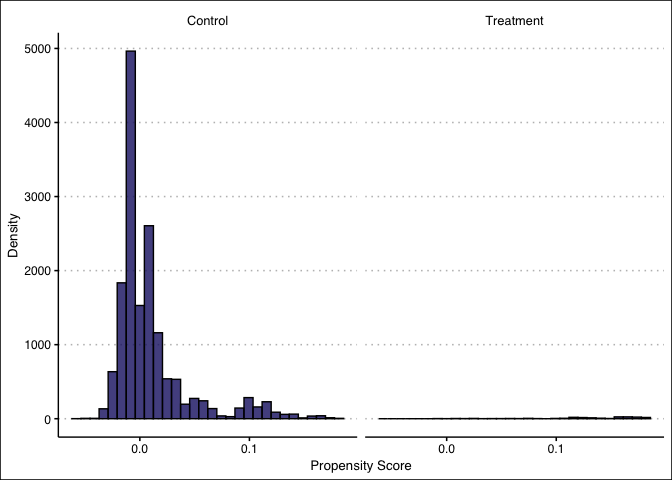
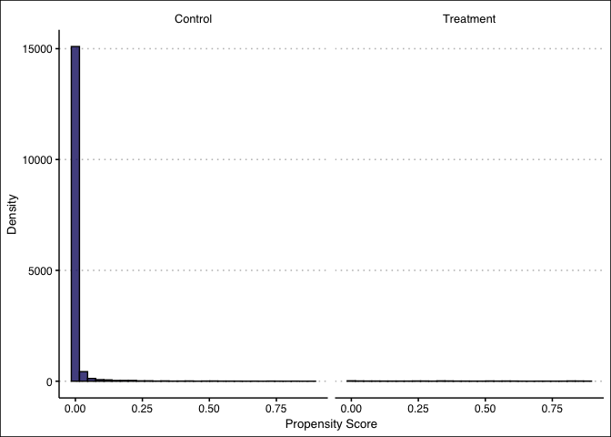
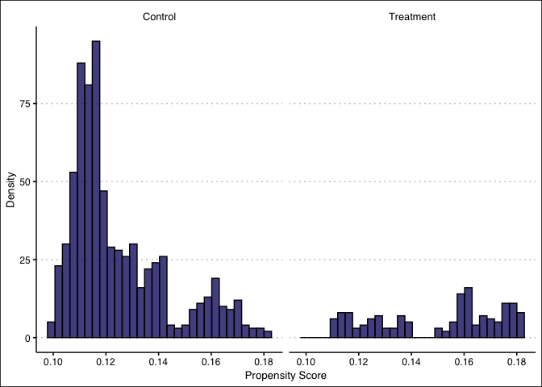
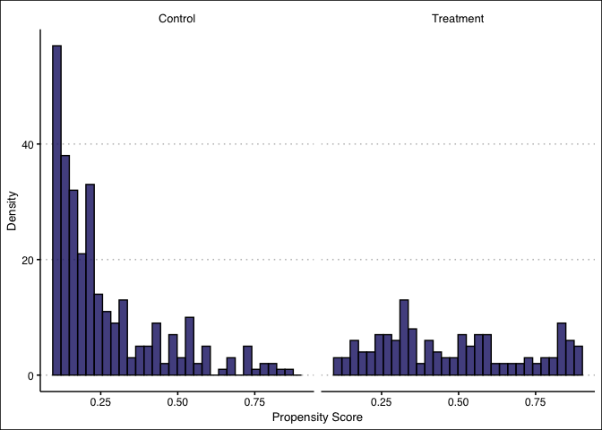

Abadie Repliction
================
Scott Cohn

In this 1986 article, LaLonde took a randomized controlled trial in
which volunteers were randomly assigned to a job trainings program or
nothing. The treatment was the program. But to illustrate the problem
with econometrics at the time, LaLonde then dropped the experimental
control group and replaced it with the PSID and the CPS in separate
analysis. Both were a random sample of the entire country. The
experimental results showed that the treatment effect was positive, but
when he used econometric modeling with a non-experimental control group,
the effect was consistently negative. A couple of papers by economists
Dehejia and Wahba in the late 1990s and early 2000s introduced a new
method called “propensity score based analysis”. Sometimes it’s called
matching and sometimes weighting. That’s because there are numerous ways
to use the propensity score. One the propensity score is trimmed; this
analysis regularly finds estimates that are nearly the same as the
experimental results.

For this project, I implement Abadie’s 2005 Restud on semiparametric
Diff-in-Diff. For the data, see `data_pull.R`, which appends the CPS
data to the original job trainings program data.

## Question 1

``` r
# load data from `data_pull.R`
nsw_cps <- read_csv("Data/nsw_cps.csv")
```

> Calculate a propensity score using the same covariates as used in the
> mixtape only use a series of polynomials for each one. You will do the
> following analysis twice: once using a logit, once using OLS, to fit
> the propensity score.

### Part A

> You will fit a linear probability model (OLS) for one of the following
> and you will fit a logit for the second.

``` r
# LPM - Quadratic
lpm <- lm(treat ~ age + agesq + educ + educsq + marr + nodegree + 
            black + hisp + re75 + u75,
          data = nsw_cps)

# Logit - Cubic
logit <- glm(treat ~ age + agesq + agecb + educ + educsq + marr + nodegree + 
               black + hisp + re75 + u75, 
             family = binomial(link = "logit"), data = nsw_cps)
```

### Part B

> Fit one propensity score using up to a quadratic for each variable for
> one set of analysis, and a cubic for a separate set of analysis.

``` r
# LPM -- Propensity Scores
prs_lpm_df <- 
  tibble(
    pr_score = predict(lpm, type = "response"),
    treat = lpm$model$treat
  )

# Logit -- Propensity Score
prs_logit_df <- 
  tibble(
    pr_score = predict(logit, type = "response"),
    treat = logit$model$treat
  )
```

### Part C

> Create a histogram showing the distribution of the propensity score
> for the treatment and control group. What is the max and min values of
> the propensity score for the treatment group? What is it for the
> control group?

``` r
tx_ctrl_labs <- c("Control", "Treatment")
names(tx_ctrl_labs) <- c("0", "1")
```

#### Linear Probability Model (LPM)

``` r
# LPM -- Histogram
prs_lpm_df %>%
  ggplot() +
  geom_histogram(aes(x = pr_score), fill = 'midnightblue', color = 'black', alpha = 0.8) + 
  labs(x = "Propensity Score", y = "Density") +
  theme_clean() + 
  facet_grid(. ~ treat, labeller = labeller(treat = tx_ctrl_labs)) 
```

<!-- -->

``` r
# LPM -- max/min
prs_lpm_df %>%
  group_by(treat) %>%
  summarise(Max = round(max(pr_score), 4), Min = round(min(pr_score), 4)) %>%
  mutate(treat = if_else(treat == 0, "Control", "Treatment")) %>%
  rename(Treat = treat) %>%
  kbl("pipe")
```

| Treat     |    Max |     Min |
|:----------|-------:|--------:|
| Control   | 0.1823 | -0.0573 |
| Treatment | 0.1824 | -0.0087 |

#### Logit

``` r
# Logit -- Histogram
prs_logit_df %>%
  ggplot() +
  geom_histogram(aes(x = pr_score), fill = 'midnightblue', color = 'black', alpha = 0.8) + 
  labs(x = "Propensity Score", y = "Density") +
  theme_clean() + 
  facet_grid(. ~ treat, labeller = labeller(treat = tx_ctrl_labs)) 
```

<!-- -->

``` r
# Logit -- max/min
prs_logit_df %>%
  group_by(treat) %>%
  summarise(Max = round(max(pr_score), 4), Min = round(min(pr_score), 4)) %>%
  mutate(treat = if_else(treat == 0, "Control", "Treatment")) %>%
  rename(Treat = treat) %>%
  kbl("pipe")
```

| Treat     |    Max |    Min |
|:----------|-------:|-------:|
| Control   | 0.8714 | 0.0000 |
| Treatment | 0.8812 | 0.0012 |

### Part D

> Drop all units whose propensity scores are less than 0.1 and more than
> 0.9 then repeat 1C

``` r
# LPM -- Histogram // filtered 
prs_lpm_df %>%
  filter(between(pr_score, 0.1, 0.9)) %>%
  ggplot() +
  geom_histogram(aes(x = pr_score), fill = 'midnightblue', color = 'black', alpha = 0.8) + 
  labs(x = "Propensity Score", y = "Density") +
  theme_clean() + 
  facet_grid(. ~ treat, labeller = labeller(treat = tx_ctrl_labs)) 
```

<!-- -->

``` r
# LPM -- max/min // filtered
prs_lpm_df %>%
  filter(between(pr_score, 0.1, 0.9)) %>%
  group_by(treat) %>%
  summarise(Max = round(max(pr_score), 4), Min = round(min(pr_score), 4)) %>%
  mutate(treat = if_else(treat == 0, "Control", "Treatment")) %>%
  rename(Treat = treat) %>%
  kbl("pipe")
```

| Treat     |    Max |    Min |
|:----------|-------:|-------:|
| Control   | 0.1823 | 0.1001 |
| Treatment | 0.1824 | 0.1098 |

``` r
# Logit -- Histogram // filtered
prs_logit_df %>%
  filter(between(pr_score, 0.1, 0.9)) %>%
  ggplot() +
  geom_histogram(aes(x = pr_score), fill = 'midnightblue', color = 'black', alpha = 0.8) + 
  labs(x = "Propensity Score", y = "Density") +
  theme_clean() + 
  facet_grid(. ~ treat, labeller = labeller(treat = tx_ctrl_labs)) 
```

<!-- -->

``` r
# Logit -- max/min // filtered
prs_logit_df %>%
  filter(between(pr_score, 0.1, 0.9)) %>%
  group_by(treat) %>%
  summarise(Max = round(max(pr_score), 4), Min = round(min(pr_score), 4)) %>%
  mutate(treat = if_else(treat == 0, "Control", "Treatment")) %>%
  rename(Treat = treat) %>%
  kbl("pipe")
```

| Treat     |    Max |    Min |
|:----------|-------:|-------:|
| Control   | 0.8714 | 0.1004 |
| Treatment | 0.8812 | 0.1067 |

## Question 2

> Calculate a before and after first difference for each unit.

``` r
# LPM -- First Difference
lpm_ey1 <- prs_lpm_df %>% 
  filter(treat == 1) %>%
  pull(pr_score) %>% 
  mean()

lpm_ey0 <- prs_lpm_df %>% 
  filter(treat == 0) %>%
  pull(pr_score) %>% 
  mean()

lpm_sdo <- round(lpm_ey1 - lpm_ey0, 4)
glue('The simple difference for the LPM model is {lpm_sdo}.')
```

    ## The simple difference for the LPM model is 0.1216.

``` r
# Logit -- First Difference
logit_ey1 <- prs_logit_df %>% 
  filter(treat == 1) %>%
  pull(pr_score) %>% 
  mean() 

logit_ey0 <- prs_logit_df %>% 
  filter(treat == 0) %>%
  pull(pr_score) %>% 
  mean() 

logit_sdo <- round(logit_ey1 - logit_ey0, 4)
glue('The simple difference for the logit model is {logit_sdo}.')
```

    ## The simple difference for the logit model is 0.3707.

## Question 3

> Construct a weighted difference-in-differences using the first
> equation at this [substack
> entry](https://causalinf.substack.com/p/callaway-and-santanna-dd-estimator)

``` r
# Dehejia and Wahba (2002) -- `see ipw.do``
nsw_dw_cpscontrol <- nsw_cps %>% cbind(pscore = prs_logit_df$pr_score)

N <- nrow(nsw_dw_cpscontrol)

#- Manual with non-normalized weights using all data
nsw_dw_cpscontrol <- nsw_dw_cpscontrol %>% 
  mutate(d1 = treat/pscore,
         d0 = (1 - treat)/(1 - pscore))

s1 <- sum(nsw_dw_cpscontrol$d1)
s0 <- sum(nsw_dw_cpscontrol$d0)


nsw_dw_cpscontrol <- nsw_dw_cpscontrol %>% 
  mutate(y1 = treat * re78/pscore,
         y0 = (1 - treat) * re78/(1 - pscore),
         ht = y1 - y0)

#- Manual with normalized weights
nsw_dw_cpscontrol <- nsw_dw_cpscontrol %>% 
  mutate(y1 = (treat*re78/pscore)/(s1/N),
         y0 = ((1 - treat)*re78/(1 - pscore))/(s0/N),
         norm = y1 - y0)

nsw_dw_cpscontrol %>% 
  pull(ht) %>% 
  mean()
```

    ## [1] -11564.42

``` r
nsw_dw_cpscontrol %>% 
  pull(norm) %>% 
  mean()
```

    ## [1] -6182.63

``` r
#-- trimming propensity score
nsw_dw_cpscontrol <- nsw_dw_cpscontrol %>% 
  select(-d1, -d0, -y1, -y0, -ht, -norm) %>% 
  filter(!(pscore >= 0.9)) %>% 
  filter(!(pscore <= 0.1))

N <- nrow(nsw_dw_cpscontrol)

#- Manual with non-normalized weights using trimmed data
nsw_dw_cpscontrol <- nsw_dw_cpscontrol %>% 
  mutate(d1 = treat/pscore,
         d0 = (1 - treat)/(1 - pscore))

s1 <- sum(nsw_dw_cpscontrol$d1)
s0 <- sum(nsw_dw_cpscontrol$d0)

nsw_dw_cpscontrol <- nsw_dw_cpscontrol %>% 
  mutate(y1 = treat * re78/pscore,
         y0 = (1 - treat) * re78/(1 - pscore),
         ht = y1 - y0)

#- Manual with normalized weights with trimmed data
nsw_dw_cpscontrol <- nsw_dw_cpscontrol %>% 
  mutate(y1 = (treat*re78/pscore)/(s1/N),
         y0 = ((1 - treat)*re78/(1 - pscore))/(s0/N),
         norm = y1 - y0)

nsw_dw_cpscontrol %>% 
  pull(ht) %>% 
  mean()
```

    ## [1] 218.7165

``` r
nsw_dw_cpscontrol %>% 
  pull(norm) %>% 
  mean()
```

    ## [1] 755.1361

When I estimate the treatment effect using inverse probability weighting
using the non-normalized weighting procedure described earlier, we find
an estimated ATT of $11,564. Using the normalization of the weights, I
get $6,182.

Then I repeat the analysis having trimmed the propensity score, keeping
only values whose scores are between 0.1 and 0.9. Now I find $218 using
the non-normalized weights and $755 using the normalized weights. And we
can see that the normalized weights are even closer.

``` r
# Callway and Sant'Anna
p_dt1 <- mean(nsw_dw_cpscontrol$pscore)

nsw_dw_cpscontrol %>%
  mutate(estimator = (re78 - re75)/p_dt1 * (treat - pscore) / (1 - pscore)) %>%
  summarise(mean(estimator),
            sd(estimator)/sqrt(n()))
```

    ##   mean(estimator) sd(estimator)/sqrt(n())
    ## 1        1282.446                1052.451

Using Callaway & Sant’Anna, I find an ATT of $1,282.

``` r
sessionInfo()
```

    ## R version 4.0.3 (2020-10-10)
    ## Platform: x86_64-apple-darwin17.0 (64-bit)
    ## Running under: macOS Big Sur 10.16
    ## 
    ## Matrix products: default
    ## BLAS:   /Library/Frameworks/R.framework/Versions/4.0/Resources/lib/libRblas.dylib
    ## LAPACK: /Library/Frameworks/R.framework/Versions/4.0/Resources/lib/libRlapack.dylib
    ## 
    ## locale:
    ## [1] en_US.UTF-8/en_US.UTF-8/en_US.UTF-8/C/en_US.UTF-8/en_US.UTF-8
    ## 
    ## attached base packages:
    ## [1] stats     graphics  grDevices utils     datasets  methods   base     
    ## 
    ## other attached packages:
    ##  [1] kableExtra_1.2.1 knitr_1.30       ggthemes_4.2.0   glue_1.4.2      
    ##  [5] forcats_0.5.0    stringr_1.4.0    dplyr_1.0.2      purrr_0.3.4     
    ##  [9] readr_1.3.1      tidyr_1.1.2      tibble_3.0.5     ggplot2_3.3.3   
    ## [13] tidyverse_1.3.0 
    ## 
    ## loaded via a namespace (and not attached):
    ##  [1] Rcpp_1.0.4.6       lubridate_1.7.8    lattice_0.20-41    statquotes_0.2.2  
    ##  [5] assertthat_0.2.1   digest_0.6.27      R6_2.4.1           cellranger_1.1.0  
    ##  [9] backports_1.1.6    reprex_0.3.0       evaluate_0.14      highr_0.8         
    ## [13] httr_1.4.2         pillar_1.4.4       rlang_0.4.10       readxl_1.3.1      
    ## [17] rstudioapi_0.13    blob_1.2.1         Matrix_1.2-18      rmarkdown_2.5     
    ## [21] labeling_0.3       webshot_0.5.2      tidytext_0.2.5     munsell_0.5.0     
    ## [25] broom_0.7.3        compiler_4.0.3     janeaustenr_0.1.5  modelr_0.1.7      
    ## [29] xfun_0.21          pkgconfig_2.0.3    htmltools_0.4.0    tidyselect_1.1.0  
    ## [33] fansi_0.4.1        viridisLite_0.3.0  crayon_1.3.4       dbplyr_1.4.4      
    ## [37] withr_2.2.0        SnowballC_0.7.0    grid_4.0.3         jsonlite_1.7.1    
    ## [41] gtable_0.3.0       lifecycle_0.2.0    DBI_1.1.0          magrittr_2.0.1    
    ## [45] scales_1.1.1       tokenizers_0.2.1   cli_2.2.0          stringi_1.5.3     
    ## [49] farver_2.0.3       fs_1.5.0           xml2_1.3.2         ellipsis_0.3.1    
    ## [53] generics_0.1.0     vctrs_0.3.4        wordcloud_2.6      RColorBrewer_1.1-2
    ## [57] tools_4.0.3        hms_0.5.3          yaml_2.2.1         colorspace_1.4-1  
    ## [61] rvest_0.3.6        haven_2.2.0
